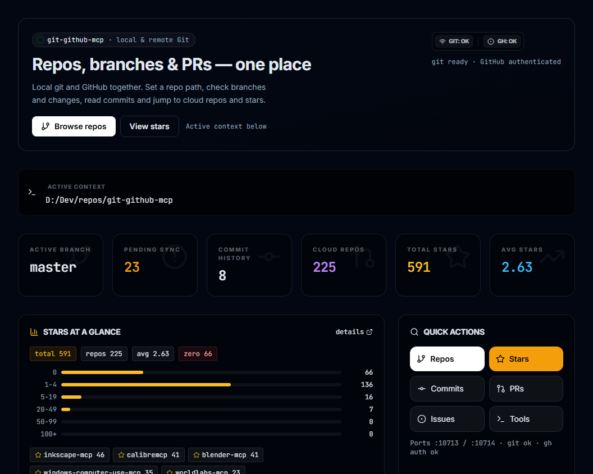
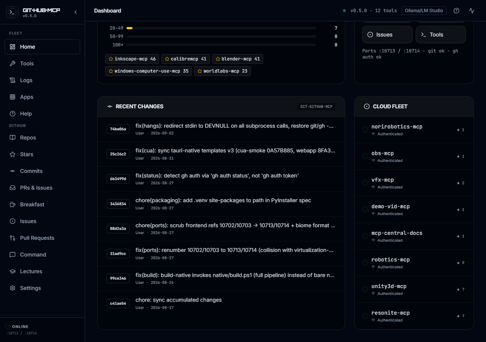

# git-github-mcp

Local git and GitHub operations for your AI agent — 12 MCP tools, a fleet
maintainer suite, and a React dashboard. No PATH surgery, no auth wrestling.

## What this wraps

[git](https://git-scm.com/doc) (local version control) and
[GitHub](https://docs.github.com) via the [`gh` CLI](https://cli.github.com/manual)
— history, branches, PRs, issues, releases, Actions, stars, search. Full
story, usage patterns, and the Gitee alternative: [docs/WRAPPEE.md](docs/WRAPPEE.md).

## Preview

| Dashboard | Activity |
|-----------|----------|
|  |  |
*Repo hero with KPIs and stars glance (left); recent changes and cloud fleet (right). Backend `:10713`, frontend `:10714`.*

## What You Can Do

- **Everyday git**: status, log, diff, clone (shallow `depth=1`), commit, push/pull — `git_core`
- **Branches & surgery**: merge, rebase, stash, tags, reset/revert, bisect, worktrees — `git_branch`, `git_admin`
- **GitHub**: issues, PRs (with triage-ready comments metadata), releases, workflows, secrets, code search — `github_ops` (66 ops)
- **Stars intelligence**: received-vs-given, per-repo boards, stargazer trajectory — `/stars`
- **CI monitor**: success/failed tiles, log tails, rerun + AI diagnose — `/ci`
- **Maintainer autopilot**: morning digest, stale flags, 15 fleet ops + full suite — `/breakfast`
- **Agentic workflows**: natural-language plans executed as tool steps (needs a sampling-capable client)
- **Learn inside the app**: git/GitHub/fleet lectures (`/lectures`) + guided help (`/help`)

Full reference: [docs/TOOLS.md](docs/TOOLS.md).

## Quick Install

1. Go to [Releases](https://github.com/sandraschi/git-github-mcp/releases/latest)
2. Download `git-github-mcp-*.mcpb`
3. Drag it onto the Claude Desktop window

Then: `gh auth login` (see [docs/ONBOARDING.md](docs/ONBOARDING.md)).
All methods: [INSTALL.md](INSTALL.md).

## Example Prompts

> "What is the git status of my current repo?"

> "List open PRs across my repos that went stale this week."

> "Find repos tagged mcp with low maintenance activity."

## Documentation

| Doc | Contents |
|-----|----------|
| [Installation](INSTALL.md) | All install methods, prerequisites |
| [Onboarding](docs/ONBOARDING.md) | `gh` install/auth, PAT, sanity check |
| [Wrapped app](docs/WRAPPEE.md) | git/GitHub history, patterns, Gitee |
| [Architecture](docs/ARCHITECTURE.md) | Transports, ports, request flow |
| [Configuration](docs/CONFIGURATION.md) | Env vars, config options |
| [Tool Reference](docs/TOOLS.md) | All 12 tools, resources, prompts |
| [Development](docs/DEVELOPMENT.md) | Contributing, local setup, gates |
| [Troubleshooting](docs/TROUBLESHOOTING.md) | Common issues, fixes |

## Requirements

Windows 10/11 (or macOS), Claude Desktop (any recent version),
`git` + `gh` CLI (`winget install Git.Git GitHub.cli`). No Python needed
for Option A. No API keys — the server never calls an LLM itself.

## License

MIT
